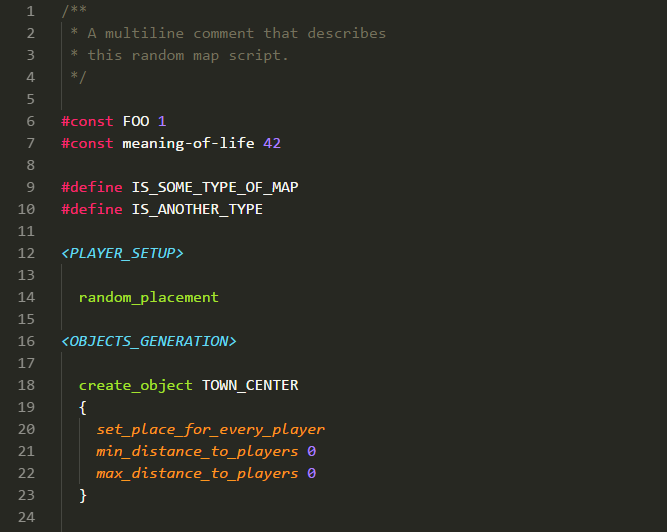

# aoe2-rms

> Age of Empires 2 Random Map Scripting support for VS Code and Sublime Text

## Install

- Visual Studio Code: `Ctrl/Cmd + Shift + X`, then `aoe2-rms`
- Sublime Text (via [Package Control](https://packagecontrol.io/)): `Install Package` in command palette, then `aoe2-rms`

## Release Notes

### 0.1.2

- Fixed highlighting of command blocks that start on the same line: `create_object TOWN_CENTER { ... }`
- Fixed parsing `if` and `elseif` where identifier is valid but not UPPER_CASE. Identifiers can be almost anything.

### 0.1.1

- Fixed highlighting of inline comments after commands and directives
- Added meta info: `LICENSE` file, links to the repo in `package.json`

### 0.1.0

- Added syntax highlighting
